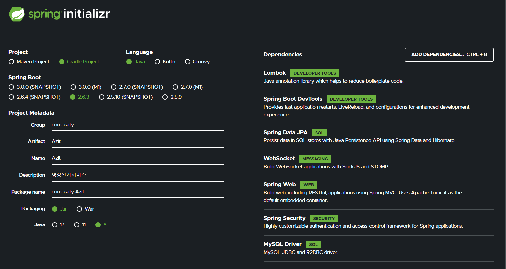

# Back End 기본 설정

1. Spring Boot Initializr로 Spring Boot + Gradle 프로젝트 생성   



2. Annotaion Processor 활성화   


3. Database 생성
   ```sql
   -- mysql workbench 또는 mysql shell에서
   create database test_web_db;
   ```