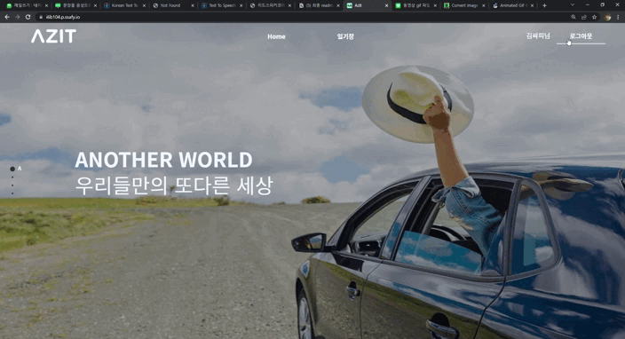
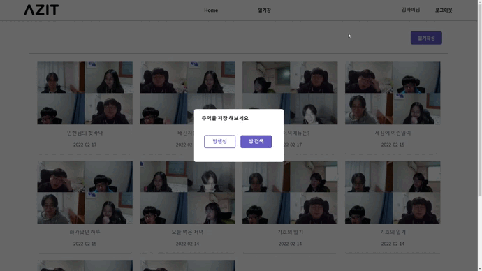

# **📸AZit - 감정분석 단체 영상일기 서비스**

# 1. 서비스 소개

------

## 1) **서비스 설명**

------

### **개요**

- 한줄 소개 : 타인과의 대화를 통해 기록 하는 감정 분석 영상 다이어리
- 서비스 명 : **아지트(Azit)**

### **타겟 🎯**

- 현재 자신의 모습을 기록 하고 싶은 사람들
- 친구들과의 추억을 쌓고 싶은 사람들
- 바쁜 일상 생활속에서 타인과의 대화를 통해 자신을 되돌아 보고 싶은 사람들
- 글보다 말하는게 좋은 사람들

## **2) 기획 배경**

------

### **배경**

우리는 타인과 대화할때 자신이 어떤 표정을 짓고 있는지 모르는 경우가 많습니다.

`아지트`는 사람들과 대화할때의 자신의 모습을 보여주고 싶었습니다.

타인과의 교류와 감정 분석을 통해 자신도 모르는 자신의 모습을 발견하며

더 깊은 힐링과 자신을 알아가는 시간을 가질 수 있습니다.

### **목적 🥅**

**감정분석과 대화를 통해 진짜 나를 발견하고 기록하자!**

## 3)**의의**

------

- 글이 아닌 영상으로 오늘의 나를 기록하자!
- 나도 잘 모르는 나를 더 알아가자!

# 2.**기술스택 및 핵심 기술**

------

## 1)**기술스택**

Front-end :


Back-end :


Tool :


## 2) **핵심 기술**

### 가.WebRTC를 사용한 화면 공유 일기 저장

> **WebRTC** (Web Real-Time Communication)은 웹 애플리케이션과 사이트가 중간자 없이 브라우저 간에 오디오나 영상 미디어를 포착하고 마음대로 스트림할 뿐 아니라, 임의의 데이터도 교환할 수 있도록 하는 기술입니다. WebRTC를 구성하는 일련의 표준들은 플러그인이나 제 3자 소프트웨어 설치 없이 종단 간 데이터 공유와 화상 회의를 가능하게 합니다.

webRTC를 기반으로 한 [openvidu](https://docs.openvidu.io/en/stable/)를 활용하여 사용자 간의 영상/음성/텍스트를 실시간으로 주고받을 수 있도록 구현하였으며, 해당 화면을 녹화하여 주고받은 영상과 음성을 언제든지 다시 볼 수 있도록 하였습니다.

openvidu의 `signal`과 `on` 을 이용하여 실시간 채팅과 차례대로 녹화할 수 있는 `toss` 기능을 구현하였습니다.

참조 링크

[openvidu vue 튜토리얼](https://docs.openvidu.io/en/stable/tutorials/openvidu-insecure-vue/)과 [openvidu REST API 문서](https://docs.openvidu.io/en/stable/reference-docs/REST-API/)를 참조하였습니다.


[openvidu vue 튜토리얼](https://docs.openvidu.io/en/stable/tutorials/openvidu-insecure-vue/) 의 openvidu 작동 방식 image

### 나. Face-Api.js를 이용한 사용자 별 감정분석

[관련링크](https://justadudewhohacks.github.io/face-api.js/docs/index.html)


`Azit` 에서는 face-api의 다양한 기능중 **`Face Expression Recognition`** 기능을 사용합니다.

사용자의 얼굴 표정을 감지하여 6가지 감정으로 분석해 저장합니다

### 다.**Web Speech API를 이용 한 영상 일기 기록**

[관련 링크](https://developer.mozilla.org/en-US/docs/Web/API/Web_Speech_API/Using_the_Web_Speech_API)

[데모](https://github.com/mdn/web-speech-api/tree/master/speech-color-changer)

> Web Speech API는 접근성 및 제어 메커니즘에 대한 흥미로운 새로운 가능성을 열어주는 음성 인식 및 음성 합성(텍스트 음성 변환 또는 tts라고도 함)이라는 두 가지 고유한 기능 영역을 제공합니다.

Web Speech API는 크롬 브라우저에서 사용 가능한 api로 높은 인식률과 빠른 반응성을 보이는 API입니다. 간단한 코드만으로 쉽게 사용할 수 있습니다.

------

# 3**. 형상관리**

------

### 1) **git**

각자 이름 이니셜로 `branch`를 생성하고, 완료된 기능은 `develop`에 `merge`하여 사용했습니다. 충돌 상황을 최소화하기 위해 `graph`와 `commit message` 를 참고하며 `merge` 하기 전 `develop` 최신 버전을 `pull`받고 작업했습니다.

또한 `commit message` 는 아래와 같은 규칙을 정해 통일하여 작성했습니다.

```bash
#   feat    : 기능 (새로운 기능)
#   fix     : 버그 (버그 수정)
#   refactor: 리팩토링
#   style   : 스타일 (코드 형식, 세미콜론 추가: 비즈니스 로직에 변경 없음)
#   docs    : 문서 (문서 추가, 수정, 삭제)
#   test    : 테스트 (테스트 코드 추가, 수정, 삭제: 비즈니스 로직에 변경 없음)
#   chore   : 기타 변경사항 (빌드 스크립트 수정 등)
```

### 2) **notion**

프로젝트 전반에 필요한 학습 내용이나 설정 정보들을 적어 공유했습니다. 또한 REST API나 명세서 등 문서화가 필요한 것들을 정리하여 공유하기 위해 사용하였습니다.

### 3) **jira**

매주 월요일 오전 회의에 한주간의 이슈를 백로그에 등록했습니다. 지난주에 완료하지 못한 이슈와 함께 이번주 진행할 이슈들을 정리하며 추가합니다.

- `Epic`은 SSAFY일정과 개발 작업 분류별로 구성하였습니다
- `Story`는 개발 작업 외 기획 및 문서 작업 시 스토리로 작성 했습니다
- `task` 는 개발 작업 업무 단위로 작성했습니다

매일 `Story`와 `task` 진행 사항을 확인 하면서 매주 Sprint를 진행하였습니다.


------

# 4**. 서비스 소개**

------

### 1) 메인 화면(fullpage.js)


fullpage.js를 사용하여 원스크롤 페이지 방식으로 제작한 메인 화면입니다.

스크롤을 내리거나 왼쪽 네비게이션을 이용하여 원하는 스크롤 페이지로 이동 할 수 있습니다.

### 2) 회원가입 및 로그인 모달



기본적인 모달창을 이용해 회원가입과 로그인 창을 구현 하였습니다.

### 3) 일기장 목록 및 내용,감정


이전에 작성한 일기장을 클릭하여 일기장 내용, 저장된 동영상, 감정 분석 결과등을 확인 할 수 있습니다.

일기 목록 조회는 infinite scroll 방식을 사용하였습니다.

### 4) 방 생성



방을 새로 만들고 싶을 경우 `일기작성` - `방생성` 버튼을 눌러 방을 만들 수 있습니다.

### 5) 방 참여


방에 참가하고 싶을 경우 `일기작성` - `방검색` 버튼을 눌러 상대방의 아이디를 검색해 방에 참가 할 수 있습니다.

### 6) 일기작성 참여(4인 참여 녹화시작 버튼 활성화) 및 채팅가능


방에 들어오게 되면 채팅기능이 활성화됩니다.

방에 참가인원이 4인이 되었을때 `녹화시작` 버튼이 활성화 됩니다.

녹화시작 버튼을 누른후 영상일기를 작성하고 자신의 일기가 작성되면 `Toss` 버튼을 눌러 다른 사람에게 발언권을 넘겨 줄 수 있습니다.

### 7) 자신의 차례에 toss버튼 활성화(다음 사람 녹음)


이전 사람이 `Toss`버튼을 눌르면 다음 사람 `Toss` 버튼이 활성화 됩니다.

마지막 사람이 `Toss`버튼을 누르게 되면 일기 제목을 입력하여 동영상을 저장 할 수 있습니다.

### 8) 저장된 일기 확인창


일기를 저장하면 일기 상세 내용을 확인 할 수 있습니다.

저장된 동영상, 음성→ 텍스트로 변화된 내용, 감정 분석 결과 정보를 확인 할 수 있습니다.

### 9) 내용 수정 가능


음성 인식을 통해 텍스트로 변환된 내용 중 오탈자를 수정하여 다시 저장 할 수 있습니다.

# 5. 프로젝트 진행

------

## 1) 담당 및 개발 일정

- **개발인원 : 장성태, 조용구, 오은진, 김유정, 김민현, 길기호**

  - Back-end : 조용구, 오은진
  - front-end: 김민현, 김유정, 길기호
  - WebRTC : 장성태

- **개발 기간 2021.01.10 ~ 2022.02.18 ( 6주 )**

  2022.01.10 ~ 2022.01.14  ㅡ 아이디어 기획 및 프로젝트 설계

  2022.01.17 ~ 2022.01.21  ㅡ 프로젝트 설계 및 와이어프레임,명세서 작성, DB설계

  2022.01.24 ~ 2022.01.28  ㅡ 명세서 작성, DB설계, jira구체화 및 역할 분배

  2022.02.03 ~ 2022.02.04  ㅡ faceAPI 및 webRTC, 메인,상세페이지

  2022.02.07 ~ 2022.02.11  ㅡ 서버배포 및 테스트, 기능구현, front- back 연동

  2022.01.14 ~ 2022.02.18  ㅡ frontend 디자인 마무리 및 UCC 제작

## 2) 설계 및 문서

- [**프로젝트명세서**](https://www.notion.so/b78208a8c4cd4c1494ba718c802fec3f)

  - [노션링크 첨부](https://www.notion.so/b78208a8c4cd4c1494ba718c802fec3f)

- **[와이어프레임](https://www.figma.com/file/EhvAmvRj5Yuso4a4OcAKnk/아지트-구조-설계?node-id=0%3A1)**

  - Figma를 사용하여 와이어 프레임을 설계 하였습니다.

  


- [ERD 설계](https://www.erdcloud.com/d/XCzc4FJJhKMQe68i2)
  - `Erdcloud` 를 사용하여 실시간으로 공유하며 데이터베이스를 설계 하였습니다.


# 6**. 실행 방법**

### Frontend

1. `front-end` 디렉토리로 이동합니다.

```bash
$ cd front-end
```

1. 필요한 `package`를 설치합니다.

```bash
$ npm install
```

1. 프로젝트를 `build` 합니다.

```bash
$ npm run build
```

1. 실행합니다.

```bash
$ npm run serve
```

### Backend

1. `back-end` 디렉토리로 이동합니다.

```bash
$ cd back-end
```

1. `gradle` 프로젝트를 `build` 합니다.

```bash
$ ./gradlew clean build
```

1. `./gradlew clean build` 가 실행이 안되면 아래 명령어를 실행 후 빌드합니다.

```bash
$ chmod 777 gradlew
```

1. 생성된 `.jar` 파일을 실행합니다.

```bash
$ java -jar Azit-0.0.1-SNAPSHOT.jar
```

### WebRTC_Openvidu

1. 아래 링크 참고하여 OpenVidu 서버를 설치하고 실행합니다. (단, Linux 환경에서만 설치 가능) https://docs.openvidu.io/en/2.19.0/deployment/ce/on-premises/

```bash
$ cd /opt/openvidu
$ sudo ./openvidu start
```


## 7. 소감 및 배운점

- 장성태 : 조금 더 욕심을 내서 여러가지 기능 추가와 프론트를 꾸미고 싶었으나 시간이 짧아 아쉬운 프로젝트였습니다.
- 김민현 : 처음으로 여러명과 함께 하는 프로젝트를 통해 협업하는 법을 배울 수 있었습니다. 익숙하지 않았던  `Jira` , `Notion` , `Gitlab` 등을 잘 사용 할 수 있게 되었습니다. 또한 Vue3.js를 사용하면서 프론트 입장에서 RESTfUL API 방식의 개발을 더 잘 이해 할 수 있었습니다. 여러모로 너무 막막 한순간들이 많았지만 그래도 또 배우는 시간이였다
- 김유정 :  처음이라 많이 어려웠지만 팀원들 덕분에 프로젝트 끝냈습니다. Vue3에 많이 적응할 수 있었고, `git`이나`Jira` 같은 협업 툴도 익숙해질 수 있는 좋은 기회였습니다
- 길기호 :다양한 기술이 필요로 하는 프로젝트여서 상당히 막막했지만, 든든했던 팀원들 덕에 프로젝트를 마무리할 수 있었던것 같습니다.  많은 걸 배워갈 수 있었던 프로젝트였습니다.
- 조용구 : 해야할 것이 많아 어려운 프로젝트였지만, 다양한 툴을 통해 프로젝트를 어떻게 더 잘 진행할 수 있는지 배울 수 있었습니다. 특히, 사용할 기회가 별로 없었던 `git` 사용법을 더 잘 이해할 수 있었던 프로젝트였습니다.
- 오은진 :  처음 사용하는 기술이 많아 어려웠지만 팀원들과 도우면서 프로젝트를 진행하니 협업의 중요성에 대해 알게 되었습니다. 이번 프로젝트로 익숙하지 않았던 `Git`, `Jira` 와 같은 협업툴 사용에 대해 알게 되어 많이 성장하게 된 것 같습니다.